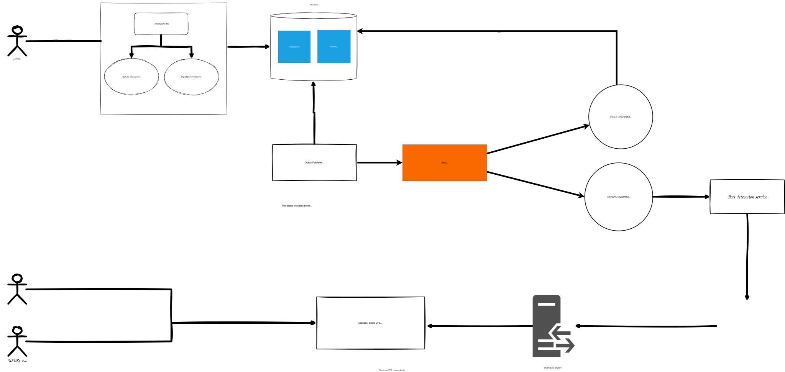

# Infra Pilot

Infra Pilot is a minimal control-plane + UI for managing projects, services,
and deployments. It stores state in Postgres, uses RabbitMQ for async work,
and runs build/deploy workflows via a worker. Built images are pushed to a
local Docker registry.

## What this repo does

- `control-plane/apps/api`: Fastify API for projects/services/deployments.
- `control-plane/apps/worker`: Worker that consumes build/deploy queues.
- `control-plane/packages/shared`: Prisma, AMQP, and event topology shared code.
- `cp-ui`: React UI that talks to the API.
- `control-plane/docker-compose.yml`: Postgres, RabbitMQ, and registry for dev.

Flow (happy path):
1. UI or client creates a project/service.
2. A deploy request creates a `Deployment` row and an outbox event.
3. The outbox publisher sends a build message to RabbitMQ.
4. The build worker builds and pushes an image to the local registry, then
   enqueues a deploy message.
5. The deploy worker marks the deployment as deployed (runner integration TBD).

## Architecture diagram



## Setup

### Prereqs

- Node.js (18+ recommended)
- Docker (for Postgres, RabbitMQ, registry, and image builds)

### Start dependencies

From `control-plane/`:

```
docker compose up -d
```

This starts:
- Postgres on `localhost:5432`
- RabbitMQ on `localhost:5672` (UI on `localhost:15672`)
- Docker registry on `localhost:5001`

### Install packages

From repo root:

```
cd control-plane && npm install
cd ../cp-ui && npm install
```

### Database migrations

From `control-plane/`:

```
npm run prisma:migrate
```

### Run the API + worker

From `control-plane/` (two terminals):

```
npm run dev:api
npm run dev:worker
```

API runs on `http://localhost:8080`.

### Run the UI

From `cp-ui/`:

```
npm run dev
```

UI runs on `http://localhost:5173` by default.

## Environment variables

`.env` files are not committed. Create them locally.

`control-plane/.env` (API + worker):
```
API_PORT=8080
DATABASE_URL="postgresql://cp:cp@localhost:5432/control_plane?schema=public"
AMQP_URL="amqp://cp:cp@localhost:5672"
JWT_SECRET="dev-secret-change-me"
NODE_ENV="development"
PRISMA_CLIENT_ENGINE_TYPE="library"
REGISTRY_HOST=localhost:5001
BUILD_WORKDIR=/tmp/cp-builds
```

`cp-ui/.env` (UI):
```
VITE_API_BASE=http://localhost:8080
```

## Useful endpoints

- `POST /dev/login` (temporary dev auth)
- `POST /projects`
- `POST /services`
- `POST /services/:id/deploy`
- `GET /projects`, `GET /services`, `GET /deployments`

## Notes

- Build worker uses Docker to build/push images. Ensure Docker is running.
- Deploy worker is stubbed; runner integration is TODO.
