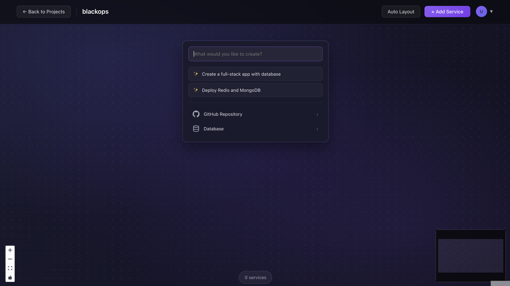
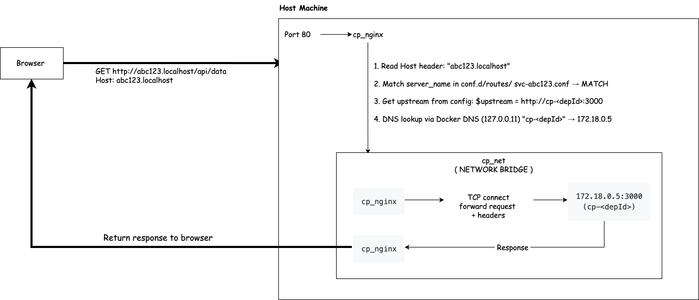

# Infra Pilot

A minimal control plane for managing projects, services, and deployments with automated builds and container orchestration



## Why I Built This

Modern platforms like Railway, Render, and Heroku abstract away the complexity of infrastructure management, but building one from scratch exposes fascinating challenges around:

* **Distributed state management** - Coordinating state across API, workers, and database
* **Reliable job orchestration** - Ensuring builds and deployments complete exactly once
* **Idempotency and retries** - Handling failures without duplicate side effects
* **Observability in async systems** - Tracking progress across decoupled components
* **Service topology visualization** - Understanding relationships between services

This project explores these problems by implementing a simplified yet functional PaaS (Platform as a Service) that can build, deploy, and manage containerized applications.

## Architecture

The system follows an event-driven architecture with clear separation of concerns:

* **Control Plane API** - Fastify-based HTTP API for user interactions
* **Worker Pool** - Background job processors for builds and deployments
* **Message Queue (RabbitMQ)** - Async job distribution and retries
* **Database (PostgreSQL)** - State persistence with Prisma ORM
* **Container Runtime (Docker)** - Image builds and container execution
* **Reverse Proxy (Nginx)** - Subdomain-based service routing
* **Object Storage (MinIO/S3)** - Deployment log archival
* **Analytics (ClickHouse)** - Structured log aggregation

## Architecture diagram


## Reverse Proxy



## Key Design Decisions

### Event-driven vs synchronous

* **Decouples API from execution** - API responds immediately, work happens async
* **Prevents timeouts** - Builds can take minutes without blocking requests
* **Enables retries and scaling** - Failed jobs can be retried; workers can scale independently

### Outbox Pattern

* Ensures at-least-once message delivery
* Events written to DB in same transaction as state changes
* Publisher polls and publishes to RabbitMQ, then marks as published
* Survives crashes between DB write and message publish

### Idempotent workers

* Atomic DB updates with status checks (`updateMany` with filter)
* Safe retries without duplicate container deployments
* Only one worker wins the race to claim a job

### State-driven system

* Every deployment has explicit status: `queued` → `building` → `deploying` → `deployed`/`failed`
* Enables observability and debugging
* Easy to identify stuck or failed deployments

### Canvas-based Service Visualization

* Interactive React Flow canvas showing service topology
* Drag-and-drop positioning with persistent coordinates
* Visual connections between dependent services
* Auto-layout for complex service graphs

## Running Locally

### Prerequisites

* Node.js 20+
* Docker & Docker Compose
* Git

### Setup

```bash
git clone <repo>
cd infra-pilot

# Install dependencies
cd control-plane && npm install
cd ../cp-ui && npm install
```

### Start infrastructure dependencies

```bash
cd control-plane
docker compose up -d

# Services started:
# - PostgreSQL on 5432
# - RabbitMQ on 5672 (AMQP) and 15672 (Management UI)
# - Docker Registry on 5001
# - Nginx on 80
# - Redis on 6379
# - MinIO on 9000/9001
# - ClickHouse on 8123/9009
```

### Run database migrations

```bash
cd control-plane
npm run prisma:migrate
```

### Start services

Terminal 1 - API Server:
```bash
cd control-plane
npm run dev:api
# API available at http://localhost:8080
```

Terminal 2 - Worker:
```bash
cd control-plane
npm run dev:worker
```

Terminal 3 - UI:
```bash
cd cp-ui
npm run dev
# UI available at http://localhost:5173
```

### Environment Variables

**control-plane/.env:**
```
API_PORT=8080
DATABASE_URL="postgresql://cp:cp@localhost:5432/control_plane?schema=public"
AMQP_URL="amqp://cp:cp@localhost:5672"
JWT_SECRET="dev-secret-change-me"
NODE_ENV="development"
REGISTRY_HOST=localhost:5001
BUILD_WORKDIR=/tmp/cp-builds
```

**cp-ui/.env:**
```
VITE_API_BASE=http://localhost:8080
```

## API

### Authentication

```bash
POST /dev/login
```

Response:
```json
{
  "token": "eyJhbGciOiJIUzI1NiIs...",
  "userId": "cl..."
}
```

### Create Project

```bash
POST /projects
{
  "name": "my-app"
}
```

### Create Service

```bash
POST /services
{
  "projectId": "cl...",
  "name": "api",
  "serviceType": "nodejs",
  "repoUrl": "https://github.com/user/repo",
  "branch": "main"
}
```

Service types: `docker`, `nodejs`, `react`, `mongodb`, `redis`

### Trigger Deployment

```bash
POST /services/:id/deploy
{
  "commitSha": "abc123"
}
```

Response:
```json
{
  "deploymentId": "cl...",
  "status": "queued"
}
```

### List Resources

```bash
GET /projects              # List all projects
GET /services?projectId=   # List services (optionally filtered)
GET /deployments           # List deployments
```

### Environment Variables

```bash
GET    /services/:id/env          # List env vars
POST   /services/:id/env          # Set env var {key, value}
DELETE /services/:id/env/:key     # Delete env var
```

### Canvas Operations

```bash
GET    /canvas/:projectId         # Get services and connections
POST   /canvas/:projectId/position/:serviceId  # Update position {x, y}
POST   /canvas/connections        # Create connection {sourceId, targetId}
DELETE /canvas/connections/:id    # Delete connection
```


## Inspiration

* **Railway** - Developer experience and deployment simplicity
* **Heroku** - Git-based deployments and buildpacks
* **Kubernetes** - Control plane patterns and reconciliation loops
* **Temporal** - Reliable workflow execution

---

## Notes

* This project is intentionally simplified for learning purposes
* Focus is on system design and reliability concepts, not production scale
* Docker-in-Docker builds run on the host for simplicity (production would use separate build nodes)
* Nginx routes services via `<serviceId>.localhost` (requires `/etc/hosts` entry or local DNS)
